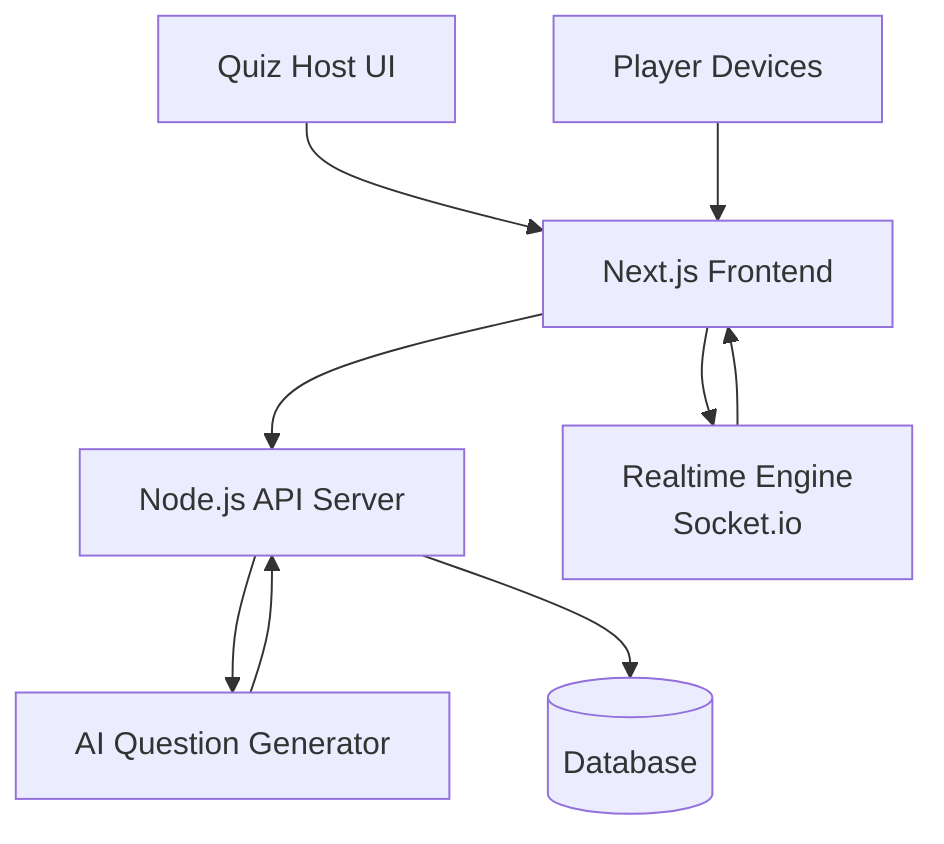

# 🧠 AI QUIZ EVENT

## 🎬 Demo

This demo shows the full flow:

* Host creates quiz using AI
* Players join using room code
* Questions appear in real‑time
* Leaderboard updates live

*(Add your demo.gif here later)*

---

## ✨ Core Features

### 🤖 AI Question Generator

Generate quiz questions automatically from any topic.
Host only needs to input:

* Quiz topic
* Number of questions
* Time per question

The AI will generate:

* Questions
* Multiple choice answers
* Correct answer

*Perfect for quickly preparing quizzes for: campus events, webinars, workshops, and ice breaking sessions.*

### ⚡ Real‑Time Quiz Engine

The quiz session runs in real‑time with synchronized timers.
Features:

* Countdown timer
* Instant answer submission
* Synchronized question display
* Responsive buttons for fast answering

*Suitable for both projector screen and participants' devices.*

### 📱 Player Experience (Mobile Friendly)

Participants answer questions from their own device.
UI designed for:

* Mobile phones
* Tablets
* Laptops

*Large colored buttons make interaction fast and intuitive.*

### 🏆 Live Leaderboard

Leaderboard updates instantly after each question.
Features:

* Real‑time ranking
* Top player highlight
* Score comparison

*This adds excitement and competition during the event.*

### 🚪 Quiz Lobby System

Players join the quiz room using a unique room code.
Lobby features:

* Room code display
* Connected player list
* Host control to start quiz

*Perfect for large event coordination.*

---

## 🏗 System Architecture



### Architecture highlights

* **Next.js** handles UI rendering
* **Express API** handles quiz logic
* **WebSocket / Socket.io** handles realtime updates
* **AI API** generates questions
* **Database** stores sessions and scores

---

## ⚙️ Tech Stack

### Frontend

* Next.js (App Router)
* TypeScript
* Tailwind CSS

### Backend

* Node.js
* Express.js

### Realtime

* WebSocket / Socket.io

### AI

* LLM API (OpenAI or compatible models)

---

## 🚀 Running Locally

### 1. Clone Repository

```bash
git clone https://github.com/Lufasu-Adm/AI-QUIZ-EVENT.git
cd AI-QUIZ-EVENT
```

### 2. Start Backend

```bash
cd server
npm install

# configure environment
cp .env.example .env

npm start
```

Backend default:

```
http://localhost:5000
```

### 3. Start Frontend

Open a new terminal:

```bash
cd client
npm install
npm run dev
```

Frontend:

```
http://localhost:3000
```

---

## 📂 Project Structure

```
AI-QUIZ-EVENT
├── client/                # Next.js frontend
├── server/                # Express backend
├── docs/
│   ├─ demo/
│   │   └─ demo.gif
│   └─ images/
│       ├─ hero-banner.png
│       ├─ feature-ai-generator.png
│       ├─ feature-realtime-quiz.png
│       ├─ feature-player-pov.png
│       ├─ feature-live-leaderboard.png
│       └─ feature-lobby.png
└── README.md
```

---

## 💡 Use Cases

AI Quiz Event can be used for:

* University events
* Online webinars
* Classroom quizzes
* Company training
* Hackathon ice breakers
* Community competitions

---

## 📈 Future Improvements

Planned features:

* [ ] AI difficulty scaling
* [ ] Analytics dashboard
* [ ] Multiplayer team mode
* [ ] Question import from PDF
* [ ] Large scale events (1000+ players)

---

## 👨‍💻 Author

Created by **Jordan Wijayanto**

GitHub: @Lufasu-Adm

---

⭐ If you like this project, consider giving it a star on GitHub!
